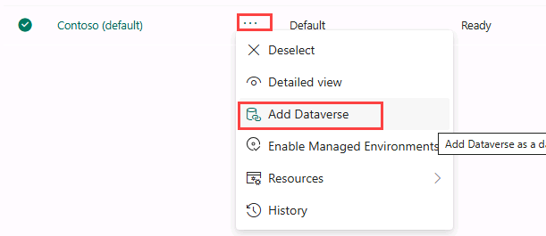
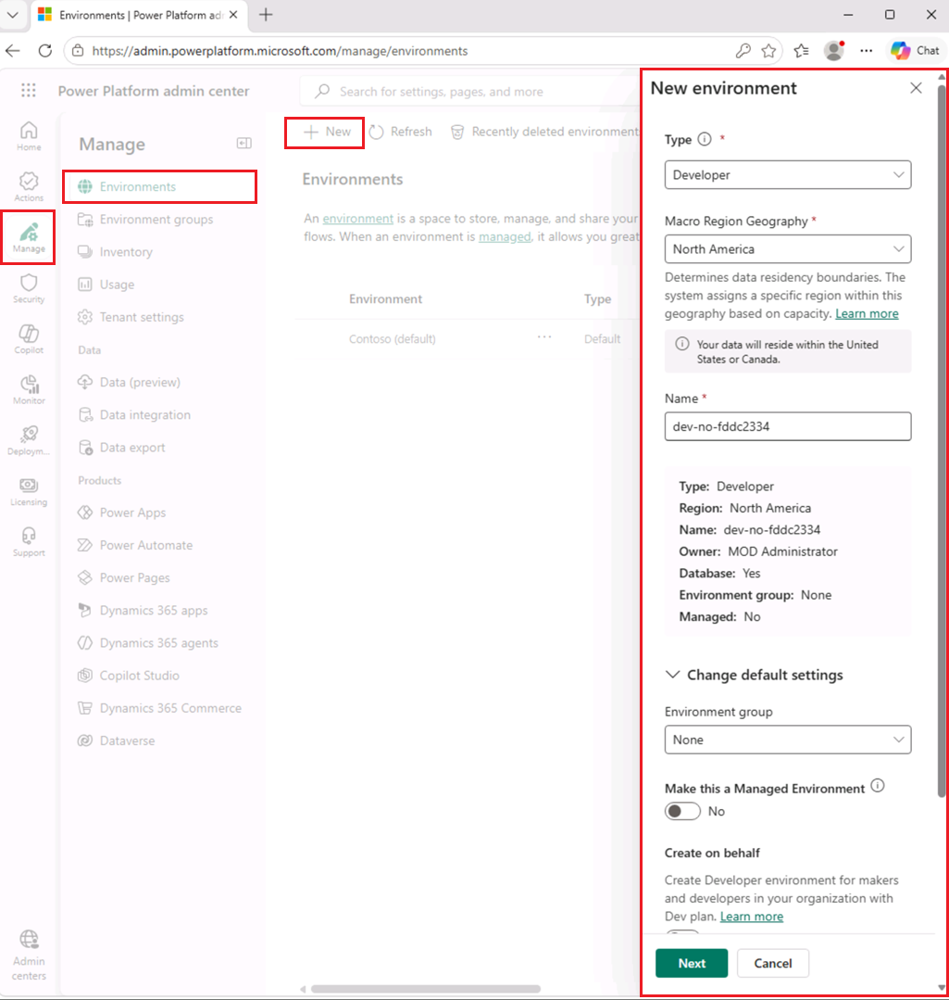
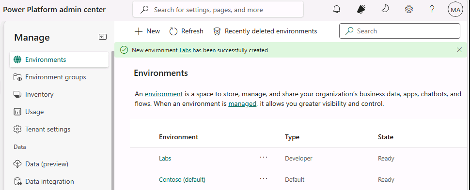
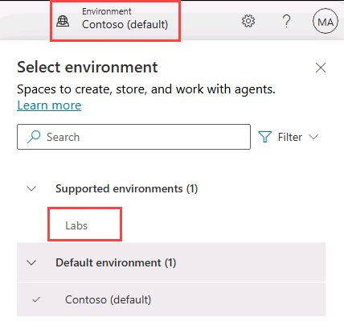

---
lab:
   title: Configuración del laboratorio de Copilot Studio
   description: En este ejercicio, accederá al portal de Microsoft Copilot Studio y creará un entorno que utilizará durante los laboratorios restantes.
  duration: 10 minutes
  level: 200
  islab: true
  primarytopics:
    - Microsoft 365
    - Microsoft Copilot Studio
---

# Crear un entorno de Power Platform

## Power Platform Admin Center

Antes de comenzar los ejercicios del laboratorio, debe crear un entorno de desarrollo para trabajar.

1. Abra un navegador web, vaya a `https://admin.powerplatform.microsoft.com/manage/environments` e inicie sesión con las credenciales que utilizará en este ejercicio.

1. Si se le solicita, elija la opción para mantener la sesión iniciada.

1. Cierre los mensajes emergentes que aparezcan.

### Agregar Dataverse al entorno predeterminado

1. Select the ellipses (**...**) for the **Contoso (default)** environment and select **Add Dataverse**.

   

1. Leave all of the default settings and select **Add**.

### Crear un entorno nuevo

1. En la página **Environments**, seleccione **+ New** para crear un entorno con la siguiente configuración:

   - **Type**: Developer
   - **Macro Region Geography**: North America
   - **Name**: *Your name*
   
   

1. En la sección **Add Dataverse**, haga clic en **+ Add Dataverse** y seleccione:

   - **Language**: English (United States)
   - **Currency**: USD ($)
   - **Deploy sample apps and data**: No

1. Seleccione **Add** y espere hasta que el estado del entorno sea **Ready** (puede usar el botón **Refresh** para actualizar la vista).

   > [!NOTE]
   > El aprovisionamiento del entorno puede tardar varios minutos, según la configuración del tenant.

   

1. En una nueva pestaña del navegador, vaya a `https://copilotstudio.microsoft.com/` e inicie sesión si se le solicita.

1. Si Copilot Studio se abre en la nueva experiencia, busque el interruptor **New experience** en la esquina superior derecha de la página y desactívelo para volver a la experiencia clásica. En el cuadro de diálogo **Submit feedback to Microsoft**, seleccione **Submit** > **Done** para cerrarlo. Si Copilot Studio se abre en la experiencia clásica, omita este paso.

   > [!NOTE]  
   > Si tiene problemas para cargar Copilot Studio en su entorno:
   > - Primero, obtenga el ID del entorno (GUID) en el centro de administración de Power Platform:
   >   1. Abra el entorno que creó en `https://admin.powerplatform.microsoft.com/manage/environments`.
   >   2. Busque el ID del entorno en la URL (una cadena larga, como `12345678-90ab-cdef-1234-567890abcdef`).
   >   3. Copie y guarde este valor.
   > - Luego intente acceder directamente al entorno pegando su ID en la siguiente URL:
   >   ```
   >   https://copilotstudio.microsoft.com/environments/<your-environment-id>/home
   >   ```

1. Si se le solicita, seleccione **Get Started** y mantenga la configuración predeterminada de país o región.

1. Omita los mensajes de bienvenida que aparezcan.

1. En la esquina superior derecha de la página, cambie de entorno con Environment Selector y seleccione el entorno que creó.

   

Ahora tiene un entorno de Power Platform en el que puede trabajar.
