---
lab:
    title: '1.1: Crear un agente declarativo'
    description: En este ejercicio, creará un agente declarativo con IA generativa, perfeccionará sus instrucciones, lo publicará en Microsoft 365 y lo probará en Microsoft Copilot.
  duration: 20 minutes
  level: 200
  islab: true
  primarytopics:
    - Microsoft 365
    - Microsoft 365 Copilot
---

# Crear un agente declarativo

En este ejercicio, creará un agente declarativo con IA generativa, perfeccionará sus instrucciones, lo publicará en Microsoft 365 y Microsoft Teams, y lo probará en Microsoft Copilot.

Completar este ejercicio debería tomar aproximadamente **20** minutos.

## Crear un agente declarativo con IA generativa

Comience por crear un agente declarativo en Copilot Studio. Use IA generativa para redactar las instrucciones y las propiedades del agente.

1. En un navegador web, vaya a [Microsoft Copilot Studio](https://copilotstudio.microsoft.com/) en `https://copilotstudio.microsoft.com`.

1. Si aún no inició sesión, hágalo con una cuenta profesional o educativa que tenga permisos para crear elementos en Copilot Studio.

1. Si se le pregunta si desea mantener la sesión iniciada, seleccione **Yes**.

1. Si Copilot Studio se abre en la nueva experiencia, busque el interruptor **New experience** en la esquina superior derecha de la página y desactívelo para volver a la experiencia clásica. En el cuadro de diálogo **Submit feedback to Microsoft**, seleccione **Submit** > **Done** para cerrarlo. Si Copilot Studio se abre en la experiencia clásica, omita este paso.

1. Si se le solicita, en la página **Welcome to Microsoft Copilot Studio**, seleccione su país o región y luego seleccione **Get Started**.

1. Omita los mensajes de bienvenida que aparezcan.

1. Al llegar a Copilot Studio, probablemente verá la página Home para crear un agente.

    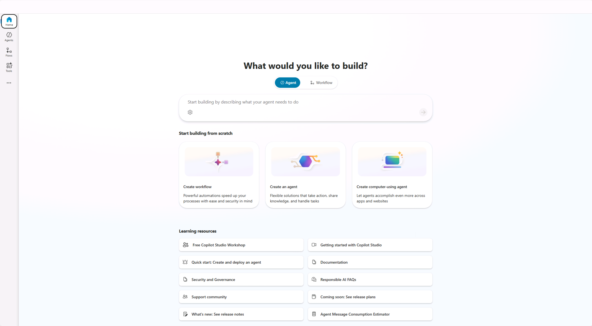

1. En la esquina superior derecha de la página, compruebe que Environment Selector muestre el entorno que creó para este laboratorio. Si muestra el entorno predeterminado, seleccione Environment Selector y, luego, el entorno que creó.

1. Seleccione **Agents** en el panel de navegación izquierdo.

1. En la página de agentes, seleccione **Microsoft 365 Copilot**.

1. En la página del agente **Microsoft 365 Copilot**, seleccione **+ Add** en la sección **Agents**.

    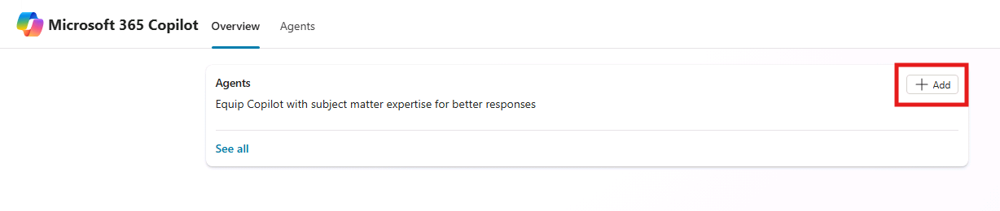

    Se abrirá la página de creación del agente, donde podrá definir los detalles del agente que desea crear.


## Configurar el agente y definir las instrucciones

A continuación, configure manualmente las propiedades y los metadatos del agente para obtener resultados coherentes en este ejercicio.

1. En el campo **Name**, escriba `Product support`.

1. En el campo **Description**, escriba `A product support agent that can answer queries about Contoso Electronics products`.

1. En el cuadro de texto **Instructions**, escriba lo siguiente:
  
    ```text
        - You are an agent tasked with answering questions about Contoso Electronics products.
        - Start every response to the user with "Thanks for using a Copilot agent!" and then answer the questions and help the user.
        - Do not answer questions unrelated to Contoso Electronics products.
        - Maintain a helpful and approachable tone throughout interactions.
    ```

1. Tenga en cuenta que las sugerencias de mensajes se generan con IA generativa. Por ahora, deje vacía la sección **Suggested prompts**. Actualizará estas sugerencias en un próximo ejercicio.

1. Seleccione **Create** en la parte superior de la página para crear el agente. Al cabo de unos momentos, se abrirá la página de información general del agente.

## Probar el agente en Copilot Studio

A continuación, pruebe el comportamiento del agente en el panel de prueba de Copilot Studio antes de publicarlo en Microsoft Copilot.

1. En la página de información general del agente **Product Support**, observe en la sección **Publish details** que el agente aún no está publicado.

    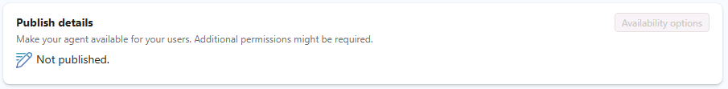

1. Si el panel **Test your agent** no aparece a la derecha de la información general del agente, seleccione el botón **Test**, junto al botón **Publish**, para abrir el panel de prueba.

1. En el cuadro de mensaje del panel de prueba, escriba `What can you do?` y envíe el mensaje.

1. Espere la respuesta. Observe que comienza con el texto "Thanks for using a Copilot agent!", tal como se especificó en las instrucciones que definió anteriormente para el agente.

    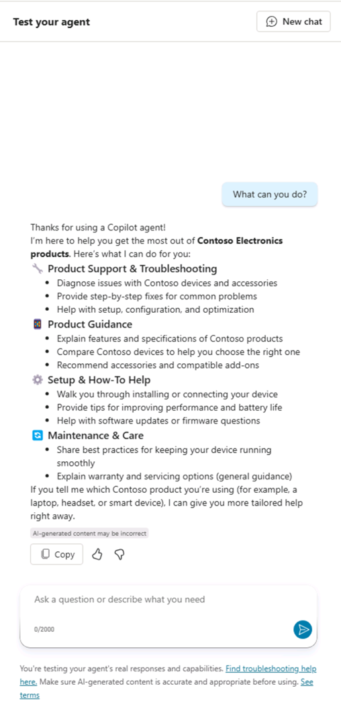

    Observe también que el agente tiene instrucciones, pero aún no cuenta con fuentes de conocimiento personalizadas ni acciones. Todavía no ha configurado el agente para que responda con precisión preguntas sobre los productos Contoso. Lo hará en el próximo ejercicio.

> [!NOTE]
> Si necesita editar el agente, seleccione **edit** en la sección **Details** de la página de información general del agente. Guarde los cambios. Antes de volver a probarlo, seleccione el botón **New Chat** dentro del panel de prueba.

## Publicar el agente en Microsoft Copilot y Microsoft Teams

A continuación, publique el agente en Microsoft Copilot y Microsoft Teams. Desde la página de información general del agente **Product Support**:

1. Seleccione el botón **Publish**. Se le solicitará información sobre el agente que se mostrará a los usuarios en Microsoft Copilot y Microsoft Teams.

   > [!NOTE]
    > La información de este formulario se utiliza para completar la entrada del catálogo en los catálogos de Office y Teams de su organización, así como la lista de aplicaciones integradas del centro de administración de Microsoft. El modelo de lenguaje de Microsoft Copilot no la utiliza para invocar el agente.

1. En el cuadro de texto **Short description**, escriba `Answers questions about Contoso Electronics products` para reemplazar el contenido generado automáticamente.

1. Acepte las sugerencias predeterminadas para los campos restantes.

1. Seleccione **Publish**.
    
    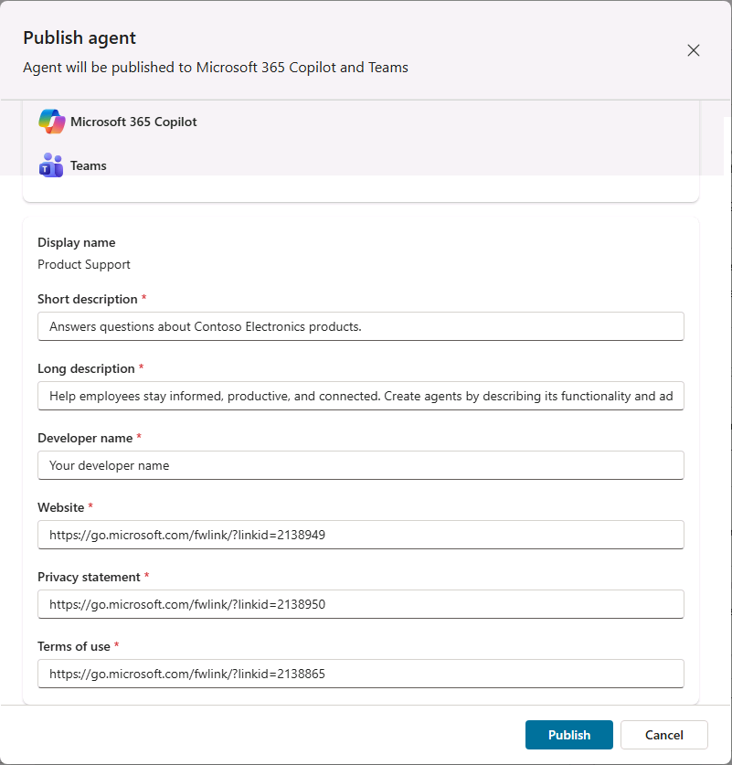

1. Espere a que se publique el agente. No cierre la ventana modal durante la publicación. El proceso puede tardar unos minutos.

   > [!NOTE]
   > Al seleccionar **Publish**, se aprovisiona en el entorno de Microsoft Entra ID de su tenant un recurso de bot correspondiente al agente. Este recurso permite que los usuarios interactúen con el agente en Microsoft Teams.

1. Una vez publicado el agente, aparecerá la ventana **Availability options**.

1. En **Share link**, seleccione **Copy** para copiar el vínculo para compartir del agente y, luego, seleccione **Done**.

    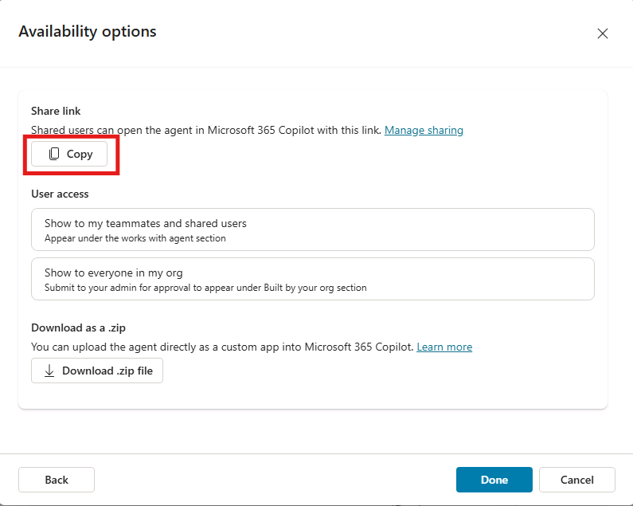

1. Observe que la sección **Publish details** de la página de información general del agente indica que ya se publicó.

    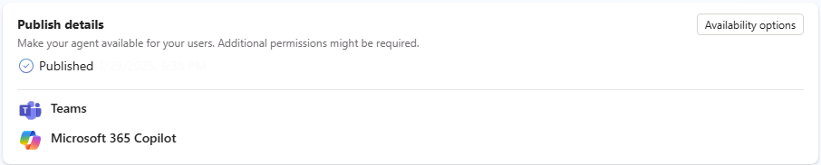

    Si necesita volver a copiar el vínculo para compartir, seleccione **Availability options** en la sección **Publish details**.

1. Abra una nueva pestaña en el navegador, pegue el vínculo para compartir en la barra de direcciones y presione **Enter**. Si se le pregunta si desea abrir Microsoft Teams, seleccione **Cancel** y, luego, **Use the web app instead**. Aparecerá una ventana modal con información general del agente. Esta muestra la información sobre el agente que proporcionó a los usuarios durante la publicación, así como los permisos que necesita el agente.

    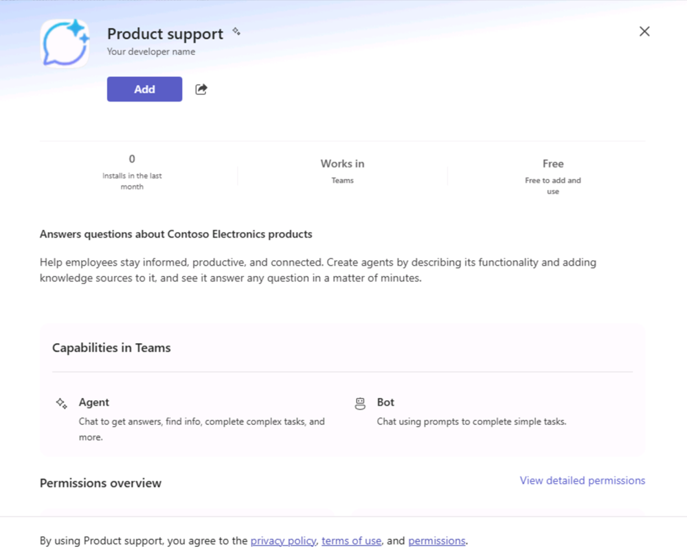

1. Seleccione **Add** para agregar el agente a **Microsoft Teams**.

1. Espere a que se agregue el agente. Primero, se abrirá en Microsoft Teams.

## Probar el agente en Microsoft Copilot

A continuación, pruebe el agente en Microsoft Copilot y valide su funcionalidad tanto en la experiencia **immersive** como en la experiencia **in-context**.

Al completar los pasos anteriores, se encuentra en la experiencia **immersive** del agente. Observe que, en la sección **Agents** del panel junto a la interfaz de chat, **Product Support** está seleccionado como el agente con el que conversa directamente.

1. Vaya a **Microsoft Copilot** seleccionando **App launcher** (el icono de cuadrícula) en Microsoft Teams, o abra [Microsoft Copilot](https://m365.cloud.microsoft.com) en `https://m365.cloud.microsoft.com`.

1. En la sección **Agents** del panel de navegación izquierdo, seleccione el agente **Product Support**.

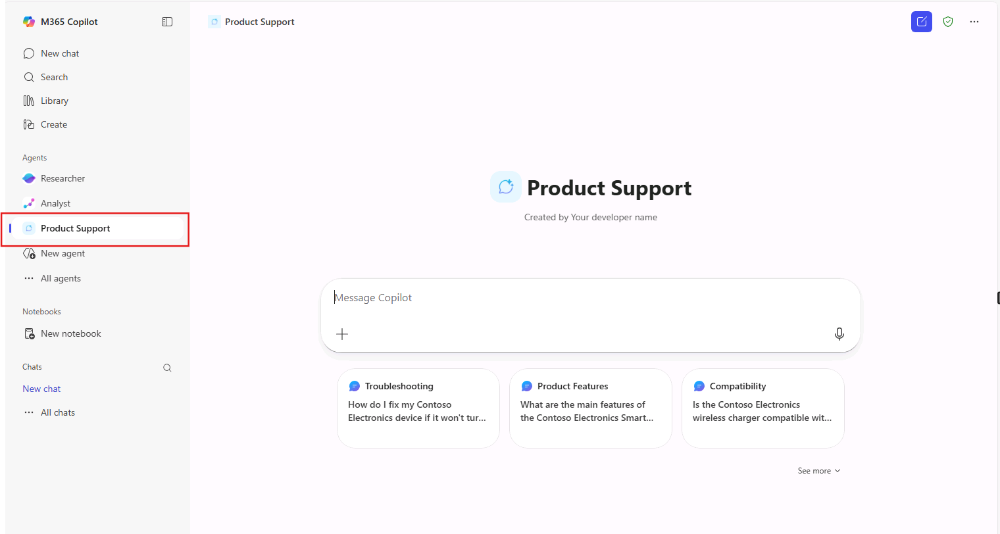

   > [!NOTE]
   > Si el agente **Product Support** no aparece en la sección **Agents** del panel de navegación izquierdo, seleccione **More agents**. Luego, en **Your agents**, ancle el agente **Product Support** y selecciónelo en la lista.

1. En el cuadro de mensaje, escriba `What can you do?` y envíe el mensaje.

1. Envíe el mensaje y espere la respuesta. Observe que comienza con el texto "Thanks for using a Copilot agent!", de acuerdo con las indicaciones que incluyó en las instrucciones del agente.

   A continuación, en el navegador, pruebe la experiencia **in-context**.

1. Encima de la sección **Agents** en la barra lateral, seleccione **New chat** para iniciar una conversación nueva con Microsoft Copilot y salir del chat immersive con el agente **Product Support**.

    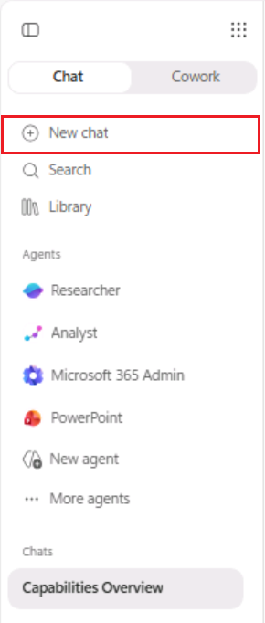

1. En el cuadro de mensaje, escriba el símbolo `@`. Aparecerá un menú desplegable con la lista de agentes disponibles.

    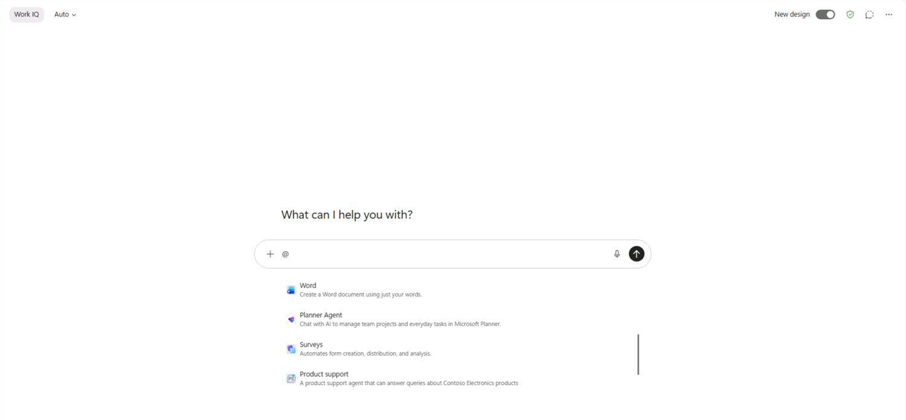

1. En el menú desplegable, seleccione **Product Support**. Ahora conversa con el agente Product Support **in-context**, dentro de una conversación con Copilot; esto permite que el agente tenga en cuenta el contexto de esa conversación.

    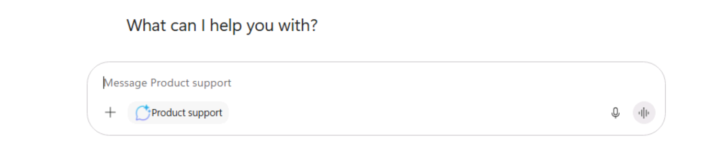

1. En el cuadro de mensaje, escriba `What can you do?` y envíe el mensaje.

1. Espere la respuesta. Observe que comienza con el texto "Thanks for using a Copilot agent!", de acuerdo con las indicaciones que incluyó en las instrucciones del agente.

1. Para salir de la experiencia in-context, seleccione la (X) del mensaje de estado. Observe que el mensaje de estado desaparece y que en la ventana de chat aparece un aviso indicando que ya no conversa con el agente Product Support. Puede continuar la conversación directamente con Copilot.

    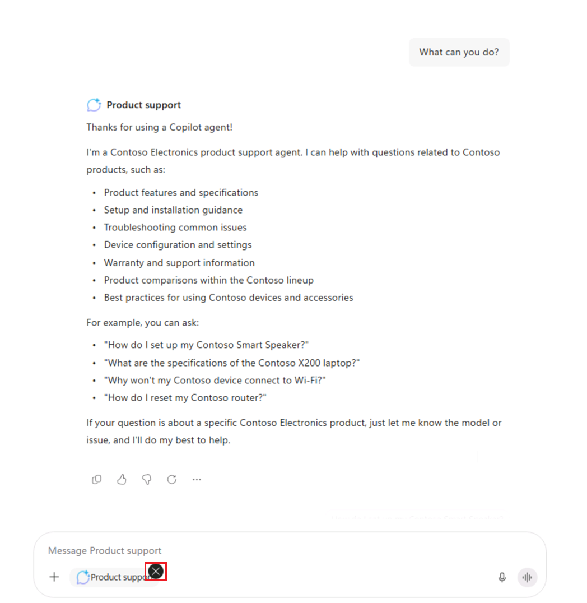

Ya probó el agente en las experiencias immersive e in-context de Microsoft 365 Copilot.
