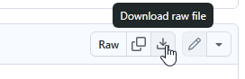
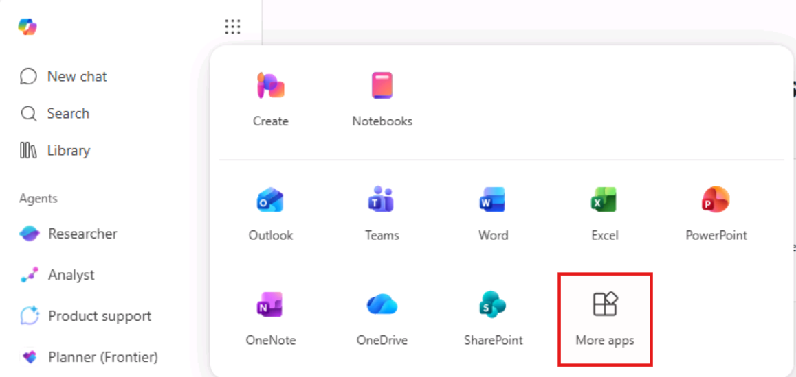
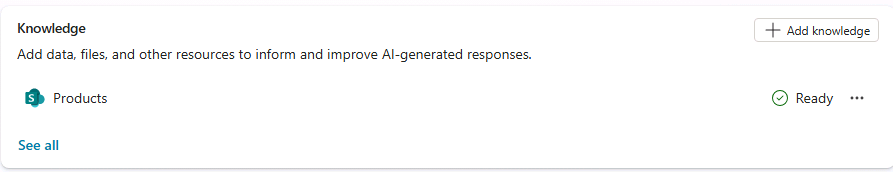
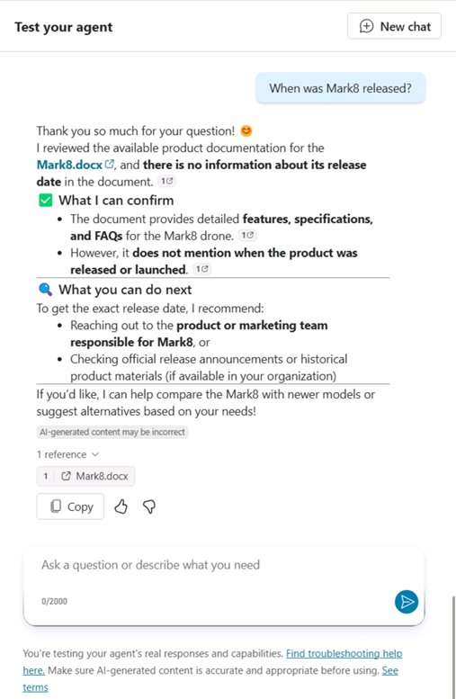

---
lab:
    title: '1.2: Agregar conocimiento personalizado'
    description: En este ejercicio, actualizará el agente declarativo que creó en el ejercicio anterior con instrucciones personalizadas y datos de grounding.
  duration: 20 minutes
  level: 200
  islab: true
---

# Agregar conocimiento personalizado

En este ejercicio, actualizará el agente declarativo que creó en el ejercicio anterior con instrucciones personalizadas y datos de grounding.

Completar este ejercicio debería tomar aproximadamente **20** minutos.

## Antes de comenzar

Antes de comenzar este ejercicio, deberá cargar en Microsoft 365 los documentos relacionados con los productos que el agente declarativo utilizará como datos de grounding. Complete los pasos siguientes para preparar el ejercicio.

> [!NOTE]
> Cuando carga documentos en un sitio nuevo de SharePoint Online, transcurre un tiempo antes de que se indexen y estén disponibles para Copilot. Si desea probar el agente de inmediato, cargue los documentos en un sitio **existente**. Los documentos se indexarán y estarán disponibles para que los use el agente sin demora. Si opta por usar un sitio nuevo de SharePoint Online, es posible que los documentos tarden más en indexarse y estar disponibles para Copilot.
>
> Las instrucciones siguientes le guían para cargar los documentos en un sitio nuevo. Si desea usar un sitio existente, comience en la sección **Cargar datos de ejemplo** y use su biblioteca existente en lugar de la biblioteca **Products**.

### Descargar los datos de ejemplo

1. En un navegador web, vaya al [repositorio de GitHub](https://github.com/MicrosoftLearning/MS-4022-Extend-Microsoft-365-Copilot-in-Copilot-Studio/blob/master/Allfiles/Products.zip) del curso en `https://github.com/MicrosoftLearning/MS-4022-Extend-Microsoft-365-Copilot-in-Copilot-Studio/blob/master/Allfiles/Products.zip`.
1. Seleccione el botón **Download raw file** para descargar **Products.zip**.

    

1. **Abra** la carpeta descargada y seleccione **Extract all** para extraer su contenido en una carpeta nueva de su equipo llamada `Products`, a la que podrá acceder más adelante.

### Crear un sitio de SharePoint

1. En el navegador web, vaya a [Microsoft Copilot](https://m365.cloud.microsoft.com) en `https://m365.cloud.microsoft.com` e inicie sesión con la cuenta de Microsoft 365 que está usando para este laboratorio.

1. Seleccione el icono **App Launcher** (el icono de cuadrícula) en la esquina superior izquierda de la página y, luego, seleccione **More Apps**.
    

1. Seleccione **SharePoint** en el catálogo de aplicaciones.

1. Omita los mensajes sobre las nuevas características y vaya a la página principal de SharePoint.

1. En el menú de navegación izquierdo, seleccione **Build**.

1. En la sección **Start building**, seleccione **Site**.

1. Seleccione **Team site** como tipo de sitio.

1. En la página **Select a site template**, en la sección **From Microsoft**, seleccione **Standard team**.

1. En la página **Preview site template**, seleccione **Use template**.

1. En la página **Give your site a name**, escriba `Product support`.

   > [!NOTE]
> Si aparece el mensaje **The site address is available with modification**, modifique el nombre del sitio hasta que el mensaje indique que la dirección está disponible. Puede aceptar el cambio sugerido o crear uno propio.

1. Cambie **Privacy settings** a **Public - anyone in the organization can access this site**.

1. Seleccione **Create site**. La creación del sitio puede tardar unos momentos; después, se activará el botón **Go to site**.

1. Seleccione **Go to site**. Se abrirá el nuevo sitio de SharePoint en el navegador.

### Crear una biblioteca de documentos

1. En el sitio de SharePoint **Product support**, seleccione **+ New** en la parte superior de la página y, luego, **Document library**.

1. En la página **Create a new document library**, en **Start from scratch or reuse**, seleccione **Blank library**.

1. En el campo **Name**, escriba `Products` y, luego, seleccione **Create**. Se abrirá la nueva biblioteca de documentos.

### Cargar datos de ejemplo

1. En la biblioteca **Products**, seleccione el botón **+ Create or upload** y, luego, **Files upload**.

1. Vaya a la carpeta de su equipo donde guardó los archivos de ejemplo descargados en un paso anterior.

1. **Seleccione todos** los archivos de la carpeta Products local y, luego, seleccione **Open** para cargarlos en SharePoint.

1. Espere a que finalice la carga. Los archivos aparecerán en la biblioteca **Products** de SharePoint.

### Copiar la URL de SharePoint

A continuación, copie la URL directa del sitio para usarla al configurar el conocimiento del agente.

1. En la página de la biblioteca **Products** de SharePoint, seleccione el icono **Settings** en la esquina superior derecha, elija **Library settings** y, luego, **More library settings**.

1. Busque la propiedad **Web address**. La **URL del sitio de SharePoint** corresponde a la parte de la dirección web que tiene el formato `https://DOMAIN.sharepoint.com/sites/SITE_NAME/LIBRARY_NAME/Forms/AllItems.aspx`. Su URL debe tener el formato `https://DOMAIN.sharepoint.com/sites/ProductSupport/Products/Forms/AllItems.aspx`, donde DOMAIN es el dominio de su tenant de Microsoft 365.

1. **Copie** la URL del sitio de SharePoint y guárdela para usarla en los próximos pasos del laboratorio. No incluya ninguna parte de la URL que aparezca después de "/Products".

## Configurar el agente con conocimiento personalizado

Agregue la URL de SharePoint al agente como fuente de conocimiento para grounding.

### Agregar la URL de SharePoint

1. En un navegador web, vaya a [Microsoft Copilot Studio](https://copilotstudio.microsoft.com/) en `https://copilotstudio.microsoft.com`.

1. Omita los mensajes sobre nuevas características.

1. Seleccione **Agents**.

1. Seleccione el agente **Microsoft 365 Copilot**.

1. Seleccione el agente **Product Support**.

1. En la sección **Knowledge** de la página de información general del agente, seleccione **Add Knowledge**.

1. En la página **Add knowledge** del asistente que se abre, seleccione **SharePoint**.

1. En el cuadro de texto, pegue la URL de la biblioteca de SharePoint **Products** y, luego, seleccione **Add**. Debe tener el formato: `https://DOMAIN.sharepoint.com/sites/ProductSupport/Products`.

1. Seleccione **Add to agent** y espere a que se agregue la fuente de conocimiento al agente. Esto puede tardar un minuto.

1. Observe que la biblioteca **Products** aparece en la sección **Knowledge** de la información general del agente.

    

> [!NOTE]
> Los agentes de Copilot Studio acceden a los documentos en nombre del usuario. El agente solo podrá obtener respuestas y contenido de los documentos a los que tengan acceso los usuarios finales.

### Actualizar las instrucciones personalizadas

A continuación, actualice las instrucciones del agente para describir cómo debe usar la fuente de conocimiento.

1. En la página de información general del agente en Copilot Studio, seleccione **Edit** en la sección **Details**.

1. Reemplace el contenido del cuadro de texto **Instructions** con lo siguiente: `You are an agent tasked with answering questions about Contoso Electronics products. Start every response by enthusiastically thanking the user for their question or comment, then respond to their question or comment. You will use documents from the Products folder in SharePoint as your source of information. If you can't find the necessary information, you should suggest that the agent should reach out to the team responsible for further assistance. Your responses should be concise and always include a cited source.`

1. Seleccione **Save** en la sección **Details**.

## Probar el agente en Copilot Studio

Por último, pruebe la capacidad del agente para usar la fuente de conocimiento personalizada.

1. En el panel **Test your agent** de la página de información general del agente en Copilot Studio, seleccione el botón **New chat** para actualizar el panel de prueba.

1. En el cuadro de texto de la conversación de prueba, escriba `Tell me about Eagle Air` y envíe el mensaje.

1. Espere la respuesta. Observe que contiene información sobre el dron Eagle Air, además de citas y referencias al documento Eagle Air almacenado en SharePoint.

    Pruebe algunas indicaciones más:

1. En el cuadro de mensaje, escriba `Recommend a product suitable for a farmer` y envíe el mensaje.

1. Espere la respuesta. Observe que contiene información sobre Eagle Air y contexto adicional sobre por qué se recomienda. La respuesta incluye citas y referencias al documento Eagle Air almacenado en SharePoint.

1. En el cuadro de mensaje, escriba `Explain why the Eagle Air is more suitable than Contoso Quad` y envíe el mensaje.

1. Espere la respuesta. Observe que explica con más detalle por qué Eagle Air es más adecuado que Contoso Quad para los agricultores.

    Por último, pruebe la respuesta alternativa haciendo una pregunta que el agente no pueda responder:

1. En el cuadro de mensaje, escriba `When was Mark8 released?` y envíe el mensaje.

1. Espere la respuesta. Observe que, tal como se indicó en las instrucciones, sugiere que el agente se comunique con el equipo responsable para obtener más ayuda.

     
