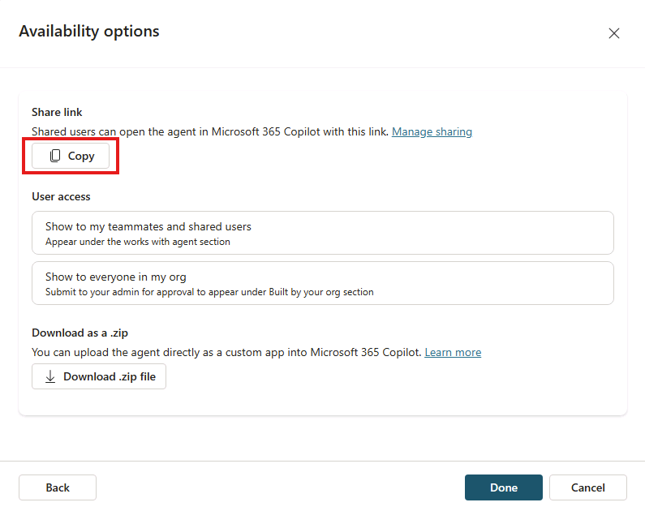
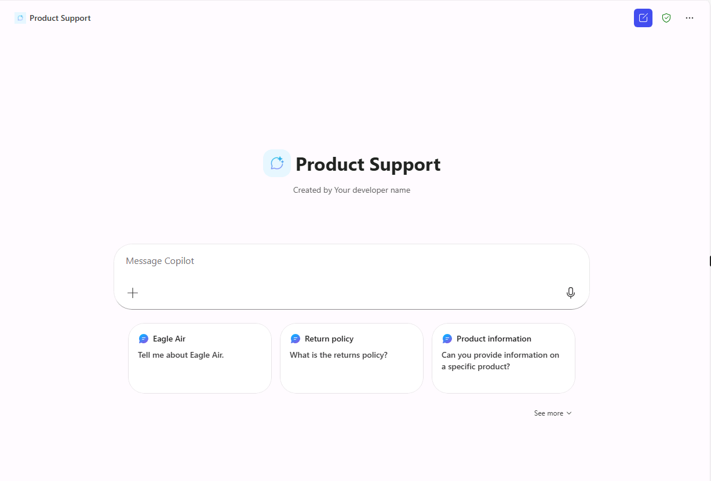

---
lab:
   title: '1.3: Agregar prompts sugeridos'
   description: En este ejercicio, actualizará el agente declarativo que creó en el ejercicio anterior con seis prompts sugeridos apropiados.
  duration: 10 minutes
  level: 200
  islab: true
---

# Agregar prompts sugeridos

En este ejercicio, actualizará el agente declarativo que creó en el ejercicio anterior con seis prompts sugeridos apropiados.

Completar este ejercicio debería tomar aproximadamente **10** minutos.

## Definir prompts sugeridos

En Copilot Studio:

1. Vaya a la página **Overview** del agente **Product Support**.

1. Tenga en cuenta que el asistente conversacional de creación de agentes puede generar prompts sugeridos durante la creación del agente. Si esto ocurre, puede reemplazarlos por otros más adecuados para las capacidades del agente.

1. En la sección **Suggested Prompts**, seleccione el icono **Edit** o el botón **Add suggested prompts**, según se hayan generado prompts durante la creación del agente o no.

1. Reemplace los prompts existentes por los siguientes:

      `Eagle Air` : `Tell me about Eagle Air`

      `Return policy` : `What is the returns policy`              

      `Product information` : `Can you provide information on a specific product?` 

      `Product troubleshooting` : `I'm having trouble with a product. Can you help me troubleshoot the issue?` 

      `Repair information ` : `Can you provide information on how to get a product repaired?`
      
      `Contact support` : `How can I contact support for help?`

1. Seleccione **Save** para guardar los cambios.

## Volver a publicar el agente

Publique el agente actualizado en Microsoft Copilot.

1. Cuando los cambios del agente se hayan guardado correctamente, seleccione **Publish** en la esquina superior derecha de la página de información general del agente en Copilot Studio.

1. En la ventana modal que se abre, seleccione **Publish**.

1. En la ventana **Availability options** que se abre, seleccione **Copy** bajo el encabezado **Share link**.

   

1. En otra pestaña del navegador, **pegue** el vínculo para compartir del agente y presione **Enter**. Aparecerá una ventana con información sobre el agente **Product Support**.

1. Espere unos momentos mientras se publican los cambios en el agente Product Support.
  
   > [!NOTE]
   > Los prompts sugeridos recién publicados pueden tardar varios minutos en aparecer en Microsoft Copilot. Si no los ve de inmediato, espere unos minutos, seleccione **New chat** y vuelva a seleccionar **Product Support**. Los prompts aparecen en una sesión nueva y vacía.

   1. Cuando se complete la actualización, vuelva a Copilot Studio y cierre la ventana modal. Si el navegador no le lleva a **Microsoft Copilot**, ábralo con el icono **App Launcher** (el icono de cuadrícula) en la esquina superior izquierda de la página.

   ## Probar el agente en Microsoft Copilot

   1. En el panel lateral de **Microsoft Copilot**, busque **Product Support** en la lista de agentes y selecciónelo para entrar en la experiencia immersive y conversar directamente con el agente. Observe que los prompts sugeridos que definió en Copilot Studio aparecen en la interfaz de usuario.

      

   1. Seleccione un prompt sugerido, envíe el mensaje y revise la respuesta.
