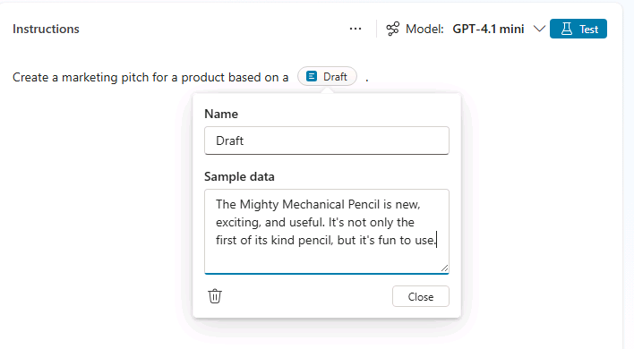
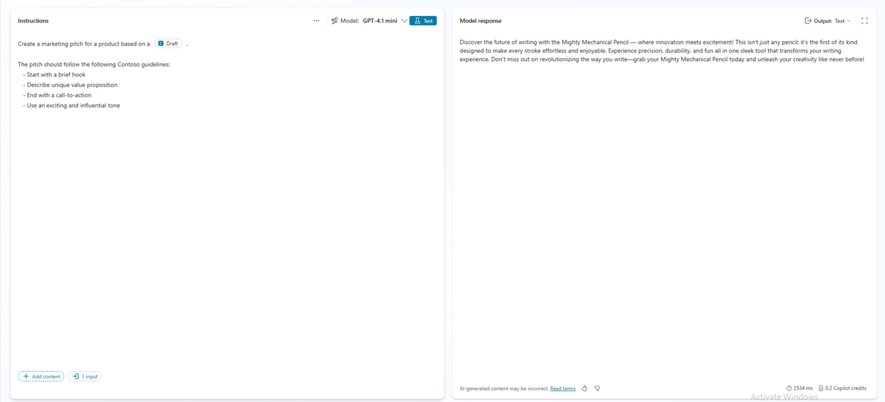
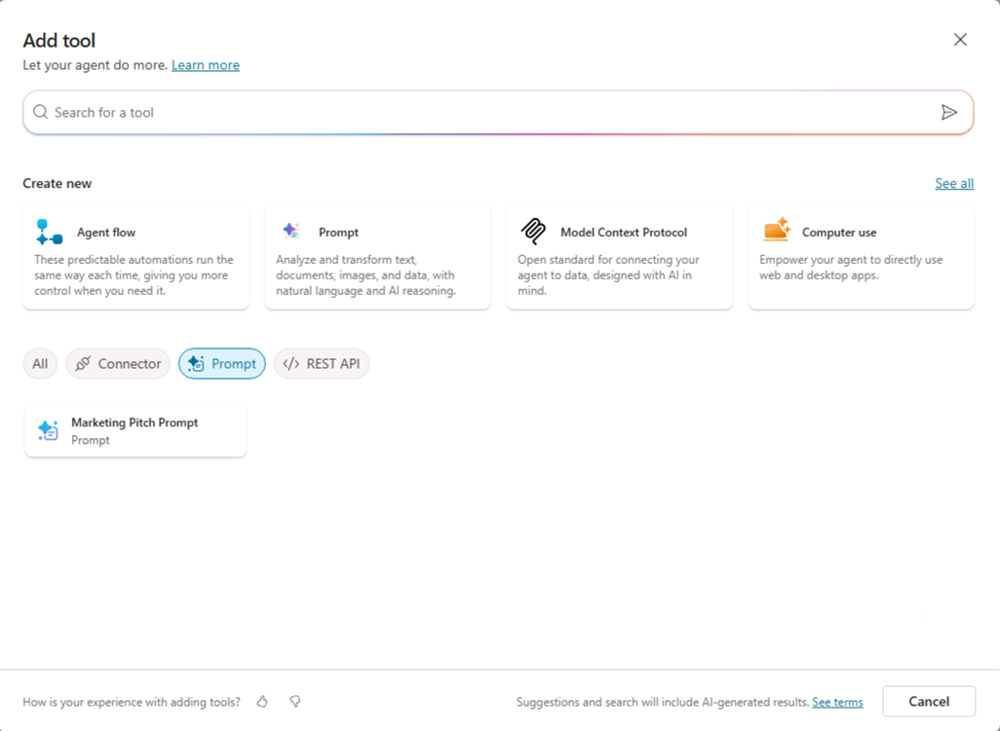
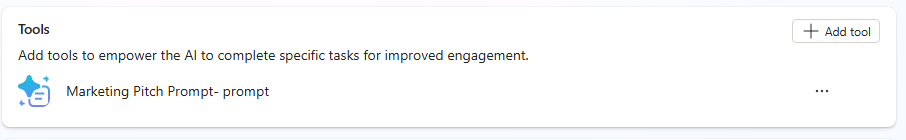

---
lab:
    title: '2.1: Crear una acción de prompt'
    description: En este ejercicio, creará una acción de prompt, probará el prompt en Copilot Studio y lo probará dentro de un agente de Copilot. Creará una acción de prompt que ayude a los usuarios a convertir sus ideas iniciales en propuestas de marketing organizadas según un formato y unas pautas específicos.
  duration: 15 minutes
  level: 200
  islab: true
---

# Crear una acción de prompt

En este ejercicio, creará una acción de prompt, probará el prompt en Copilot Studio y lo probará dentro de un agente de Copilot. Creará una acción de prompt que ayude a los usuarios a convertir sus ideas iniciales en propuestas de marketing organizadas según un formato y unas pautas específicos.

Completar este ejercicio debería tomar aproximadamente **15** minutos.

## Crear un prompt personalizado en Copilot Studio

1. Abra Copilot Studio en el navegador web; para ello, vaya a [Copilot Studio](https://copilotstudio.microsoft.com) en `https://copilotstudio.microsoft.com`.

1. Si Copilot Studio se abre en la nueva experiencia, busque el interruptor **New experience** en la esquina superior derecha de la página y desactívelo para volver a la experiencia clásica. En el cuadro de diálogo **Submit feedback to Microsoft**, seleccione **Submit** > **Done** para cerrarlo. Si Copilot Studio se abre en la experiencia clásica, omita este paso.

1. En la esquina superior derecha de la página, compruebe que Environment Selector muestre el entorno que creó para este laboratorio. Si muestra el entorno predeterminado, seleccione Environment Selector y, luego, el entorno que creó.

1. Seleccione **Tools** en el panel de navegación izquierdo.

1. Seleccione **+ New tool**.

1. En el cuadro de diálogo **New tool**, seleccione **Prompt**. Se abrirá la interfaz del generador de prompts. Copilot está disponible en esta ventana, pero en este ejercicio definirá el prompt manualmente.

1. En el cuadro de texto de la parte superior de la ventana, seleccione el nombre generado automáticamente y reemplácelo por `Marketing Pitch Prompt`.

1. En el cuadro de texto **Instructions**, escriba `Crea una propuesta de marketing para un producto basada en un `.
1. Coloque el cursor al final de la frase que escribió y, luego, seleccione **Add content**.

1. Seleccione **Text**.

1. En el campo **Name**, escriba `Draft`.

1. En el campo **Sample data**, escriba `El Mighty Mechanical Pencil es nuevo, emocionante y útil. No solo es el primer lápiz de su tipo, sino que también es divertido de usar.` y, luego, seleccione **Close**.

    

## Probar y perfeccionar el prompt

1. Seleccione **Test**, encima del cuadro de instrucciones, para probar el prompt con los datos de ejemplo que proporcionó.

1. Consulte el resultado de la prueba en la sección **Model response**.

   Perfeccione el prompt para generar resultados más estructurados y coherentes.

1. En el cuadro de texto **Instructions**, agregue lo siguiente a las instrucciones existentes para modificar el prompt:

    ```plaintext
    The pitch should follow the following Contoso guidelines:
       - Start with a brief hook
       - Describe unique value proposition
       - End with a call-to-action
       - Use an exciting and influential tone
    ```

1. Seleccione **Test** de nuevo para volver a probar el prompt.

1. Observe cómo cambia la respuesta.
    

1. Seleccione **Save** para guardar el prompt.

## (Opcional) Agregar una acción de prompt a un agente

Si completó el laboratorio anterior y creó un agente declarativo, puede agregar esta acción al agente y actualizar sus instrucciones para que hagan referencia a ella.

### Agregar la herramienta de prompt

1. En la barra lateral de Copilot Studio, seleccione **Agents**.

1. Seleccione **Microsoft 365 Copilot**.

1. En **Agents**, seleccione el agente **Product Support** al que desea agregar la acción.

1. En la sección **Tools** de la página, seleccione **Add tool**.

1. Seleccione el filtro **Prompt**.

1. Seleccione la herramienta **Marketing Pitch Prompt**.

    
    
1. Seleccione **Add and configure** y espere a que se agregue la herramienta. Ahora aparecerá en **Tools** del agente Product Support.

    

### Actualizar las instrucciones y los prompts iniciales del agente

Actualice las instrucciones del agente para indicarle cómo usar el prompt.

1. En la sección **Details**, seleccione **Edit**.

1. En el cuadro de texto **Instructions**, agregue el siguiente texto a las instrucciones existentes: `Usa la herramienta Marketing Pitch Prompt para crear propuestas de productos que sigan las pautas de Contoso y se basen en las ideas preliminares de los usuarios.`

1. Seleccione **Save** para guardar los cambios.

1. En la sección **Suggested prompts**, reemplace el prompt sugerido de Eagle Air por el siguiente y, luego, seleccione **Save** para guardar los cambios: `Propuesta de marketing` : `Crea una propuesta de marketing que siga las pautas de Contoso y se base en el siguiente borrador:`.

Ha completado el ejercicio y creado una herramienta de prompt para el agente.
