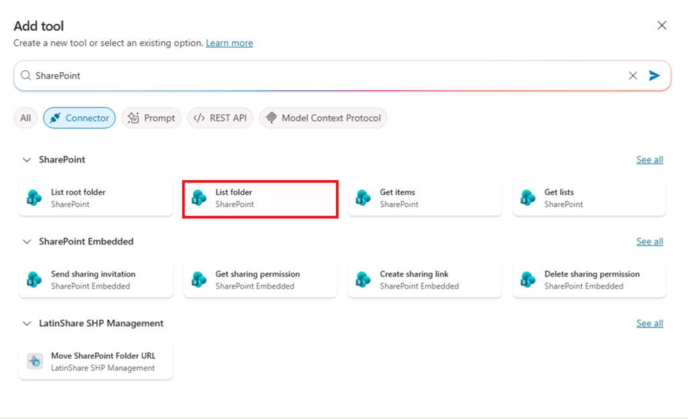
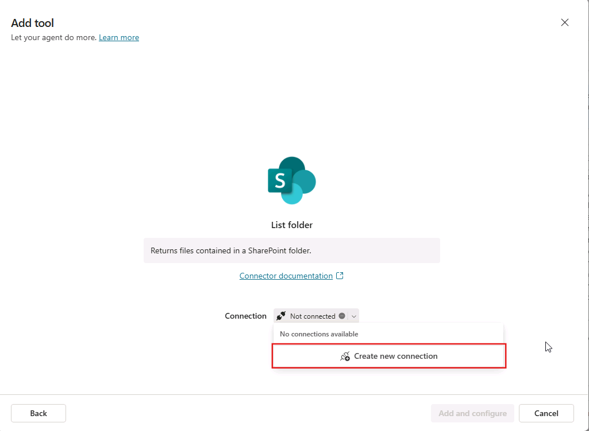
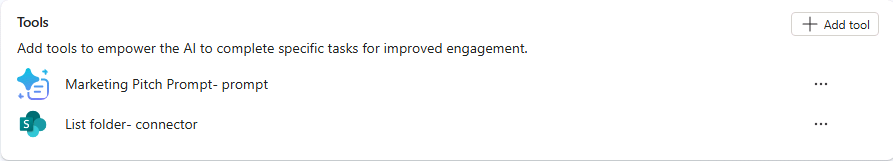
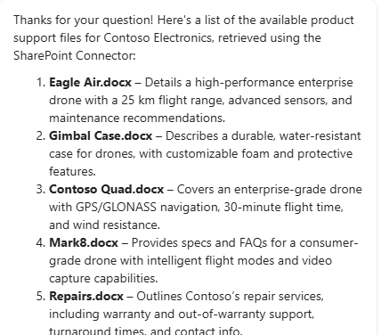

---
lab:
    title: '3.1: Crear una herramienta de conector'
    description: En este ejercicio, configurará una herramienta de conector para un agente declarativo en Copilot Studio. Usará el conector "SharePoint - List folder" para obtener una lista de archivos de una carpeta Products que contiene archivos de soporte de productos.
  duration: 15 minutes
  level: 200
  islab: true
---

# Crear una herramienta de conector

En este ejercicio, configurará una herramienta de conector para un agente declarativo en Copilot Studio. Usará el conector "SharePoint - List folder" para obtener una lista de archivos de una carpeta Products que contiene archivos de soporte de productos.

Completar este ejercicio debería tomar aproximadamente **15** minutos.

## Antes de comenzar

Este ejercicio se centra en agregar herramientas de conector a un agente existente. Se supone que se cumple lo siguiente:

1. Ya creó un agente declarativo **Product Support** en Copilot Studio. Si necesita instrucciones para crear un agente declarativo, consulte: [Crear un agente declarativo](../01-Build-your-first-declarative-agent/01-create-declarative-agent.md).

1. Tiene un sitio de SharePoint llamado **Product Support** que contiene una biblioteca de documentos llamada **Products**, con archivos de datos de ejemplo relacionados con productos. Para obtener instrucciones, consulte la sección **Antes de comenzar** del ejercicio: [Agregar conocimiento personalizado](../01-Build-your-first-declarative-agent/02-add-custom-knowledge.md).

## Crear una herramienta de conector de SharePoint a partir de un conector precompilado

Use el conector precompilado SharePoint List Folder para crear una herramienta de conector y agregarla al agente.

1. En el navegador web, vaya a [Copilot Studio](https://www.copilotstudio.microsoft.com) en `https://www.copilotstudio.microsoft.com`.

1. Si Copilot Studio se abre en la nueva experiencia, busque el interruptor **New experience** en la esquina superior derecha de la página y desactívelo para volver a la experiencia clásica. En el cuadro de diálogo **Submit feedback to Microsoft**, seleccione **Submit** > **Done** para cerrarlo. Si Copilot Studio se abre en la experiencia clásica, omita este paso.

1. En la esquina superior derecha de la página, compruebe que Environment Selector muestre el entorno que creó para este laboratorio. Si muestra el entorno predeterminado, seleccione Environment Selector y, luego, el entorno que creó.

1. En la barra lateral, seleccione **Agents**.

1. Seleccione **Microsoft 365 Copilot**.

1. En **Agents**, seleccione el agente **Product Support**.

1. En **Tools**, seleccione **+ Add tool**.

1. En el cuadro de diálogo **Add tool**, seleccione el botón **Connector** para filtrar las herramientas de conector. Luego, escriba `SharePoint` en la barra **Search** y seleccione **Search** o presione **Enter**. Espere a que aparezcan los conectores pertinentes en la ventana.

1. Busque y seleccione el conector de SharePoint **List Folder**.

    

1. La ventana modal muestra una conexión para el conector de SharePoint. Cuando la conexión esté activa, aparecerá una marca de verificación verde junto al conector. Puede seleccionar **...** para ver los detalles de la conexión. Si el estado es **Not connected**, seleccione la lista desplegable junto a **Not connected** y seleccione **Create new connection**.

    

1. En el cuadro de diálogo **Connect to SharePoint**, seleccione **Connect directly (cloud services)** y, luego, **Create**.

1. Se le solicitará que inicie sesión. Use la cuenta de M365 que está utilizando para el ejercicio.

1. Una vez establecida la conexión, en el cuadro de diálogo **Add tool**, seleccione **Add and configure** para agregar la herramienta al agente.

1. Confirme que la herramienta **List folder - connector** aparezca en la sección **Tools** del agente.

    

## Configurar la herramienta de conector para el agente

Configure las propiedades de la herramienta de conector del agente.

1. En la página del agente **Product Support**, en **Tools**, seleccione la herramienta **List folder - connector** que agregó en la sección anterior.

1. En el cuadro de texto **Name**, escriba `Listar archivos de soporte de productos`.

1. En el cuadro de texto **Description**, escriba `Lista los archivos de soporte de productos disponibles en la carpeta Products`.

1. Seleccione el interruptor junto a **Additional details** para mostrar propiedades adicionales.

1. En el cuadro de texto **Description** de la sección **Additional details**, escriba `Inicie sesión para acceder al sitio de SharePoint Product Support`.

1. En la sección **Inputs**, busque la entrada **Site Address**.

1. En el cuadro de texto **Value**, seleccione su sitio de SharePoint **Product Support** en la lista desplegable, o seleccione **Enter custom value** e introduzca la URL con el formato `https://DOMAIN.sharepoint.com/sites/ProductSupport`.

1. A continuación, busque la entrada **File Identifier**. Establezca el campo **Fill using** en **Custom**.

1. En el cuadro de texto **Value** de **File Identifier**, escriba `Products`.

1. Seleccione **Save** en la parte superior de la página para guardar los cambios.
   
## Modificar las instrucciones del agente

Actualice también las instrucciones del agente para indicarle cómo usar la herramienta de conector.

1. Vuelva a la página de información general del agente **Product Support**.

1. En la sección **Details** del agente **Product Support** en Copilot Studio, seleccione **Edit**.

1. En el cuadro de texto **Instructions**, agregue lo siguiente a las instrucciones existentes: `Cuando le pregunten por los recursos de soporte disponibles, use el conector de SharePoint para enumerar los archivos de la carpeta Products e informe al usuario que utilizó el conector de SharePoint.`

1. Seleccione **Save**.

## Probar el agente con la herramienta

1. Expanda el panel **Test your agent** en el lado derecho de la página de detalles del agente.

1. Seleccione el botón **New chat** del panel de prueba para cargar los cambios más recientes del agente.

1. En el cuadro de mensaje, escriba `¿Qué archivos de soporte de productos están disponibles?` y envíe el mensaje.

1. Si aparece el mensaje **Connect to continue**, seleccione **Allow** para permitir que el agente use sus credenciales para conectarse a SharePoint.

1. Observe que el agente responde con un comentario sobre el conector utilizado, tal como se indicó, y enumera los archivos disponibles en la carpeta Products.

    

Ha comprobado que la herramienta de conector funciona según lo previsto en el agente y ha completado este ejercicio.
